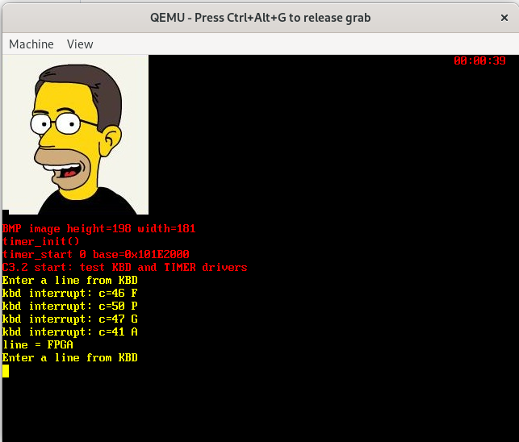
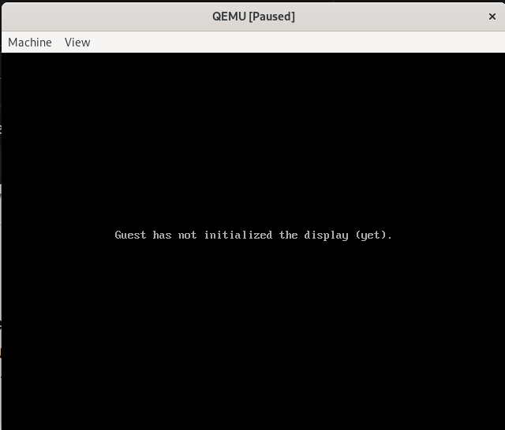

# Lecture Homework Week 06 - Thursday

For this lecture homework, you will explore the interrupt-driven keyboard device driver and learn basic debugging techniques using GDB and QEMU.

## Getting the Code

As with the previous lecture homework, this assignment is hosted on GitHub. Create your own repository using the assignment repository as a template. To do this:

1.  Click on **"Use this template."**
2.  Select **"Create a new repository."**
3.  Give your repository a descriptive name.
4.  Click **"Create repository."**

Once created, clone the repository or open it in a GitHub Codespace to begin working.

## Adding Your Logo

If you attempt to compile the program immediately after cloning, it will fail with the following error:

```bash
mkdir build
cmake -S . -B build
cmake --build build
...
arm-none-eabi-objcopy: '../image0.bmp': No such file
...
```

This occurs because no image is included in the repository to act as your OS logo. You must provide your own logo (`image0.bmp`). Convert your chosen image to BMP format if it isn't already.

**Requirements:**
1.  The image must be an appropriate size to fit on the display.
2.  The image must be a **new** image (not the same `image0.bmp` used in the previous lab).

## Running the Code

Compile the project as you have done previously and run it using QEMU:

```bash
qemu-system-arm -M versatilepb -m 128M -kernel build/keyboard.bin -serial mon:stdio
```

## The Keyboard Demo

The code allows you to type text into the QEMU Graphical User Interface (GUI). Click inside the QEMU window and start typing. You should see keyboard events appear on the screen until you press the **Enter** key, at which point the entire text string is printed.

You should see something like this:



### Let's Break It

The original code from `start.s` (as seen on page 62 of the textbook) uses the following `irq_handler` routine:

```asm
irq_handler:
  sub lr, lr, #4
  stmfd sp!, {r0-r12, lr}   // stack ALL registers
  bl IRQ_handler            // call IRQ_handler() in C
  ldmfd sp!, {r0-r3, r12, pc}^ // return
```

At first glance, this might look functional. However, the `stmfd` and `ldmfd` instructions are **asymmetrical**. While `stmfd` pushes 14 registers (`r0-r12` and `lr`), `ldmfd` only pops 6 registers (`r0-r3`, `r12`, and `pc`). 

This causes two major issues:
1.  **Register Corruption**: Registers `r4-r11` are not restored to their original state.
2.  **Stack Pointer Misalignment**: Because we popped fewer registers than we pushed, the Stack Pointer (`sp`) will not point to the correct location after the return, eventually leading to a system crash or unpredictable behavior.

#### Reintroducing the Bug
Reintroduce this bug into your code. Open [`src/start.s`](src/start.s) and replace the correct handler with the broken code shown above.

Recompile and run the program. Observe the change in behavior and take a screenshot of the QEMU window showing the misbehaving code. Save this in the `assets/` directory.

### Using GDB with QEMU

To understand exactly what is happening, we will use the GNU Debugger (GDB).

#### 1. Compile with Debug Symbols
Ensure your code is compiled with the `Debug` configuration. If using the command line:

```bash
cmake -S . -B build -DCMAKE_BUILD_TYPE=Debug
cmake --build build --target clean
cmake --build build
```

#### 2. Start QEMU in Debug Mode
Run QEMU with the `-s` (starts a gdbserver on TCP port 1234) and `-S` (freezes CPU at startup) flags:

```bash
qemu-system-arm -M versatilepb -m 128M -kernel build/keyboard.bin -serial mon:stdio -s -S
```
*Note: The QEMU window will appear black and frozen; this is expected.* It should look like:



#### 3. Connect GDB
Open a **second terminal** and launch the debugger:

```bash
gdb-multiarch build/keyboard.elf
```

You should see the following:
```bash
For help, type "help".
--Type <RET> for more, q to quit, c to continue without paging--
Type "apropos word" to search for commands related to "word"...
Reading symbols from build/keyboard.elf...
(gdb) 
```

Inside GDB, connect to QEMU:

```bash
(gdb) target remote localhost:1234
Remote debugging using localhost:1234
0x00000000 in ?? ()
(gdb) 
```

Since we changed code in the `irq_handler` subroutine, let's set a breakpoint in this
subroutine. The following GDB interaction shows this process:

```bash
(gdb) break irq_handler
Breakpoint 1 at 0x1001c: file  /workspaces/lecture-homework-week06-r/src/start.s, line 21.
(gdb) 
```

Once we have the breakpoint set, we can continue the execution of our QEMU program and see
what happens once the `irq_handler` subroutine is reached. The following GDB interaction
shows this process:

```bash
(gdb) continue
Continuing.

Breakpoint 1, irq_handler () at  /workspaces/lecture-homework-week06-r/src/start.s:21
21          sub lr, lr, #4
(gdb) 
```

Now, use next to step through the assembly until you reach the `ldmfd` instruction. **Use `step` (not `next`) to execute the `ldmfd` instruction.**

```bash
(gdb) next
22          stmfd sp!, {r0-r12, lr} // stack ALL registers
(gdb) next
23          bl IRQ_handler // call IRQ_hanler() in C
(gdb) next
24          ldmfd sp!, {r0-r3, r12, pc}^ // return
(gdb) step
0x00000000 in ?? ()
(gdb) info register pc
pc             0x0                 0x0
(gdb) 
```

If you're not sure what instruction is at address at the PC, try the following GDB interaction:
```bash
(gdb) x/i 0x00000000
=> 0x0: ldr     pc, [pc, #24]   @ 0x20
(gdb)
```

This should give you enough information to understand what is happening. You will answer questions
about what you think is happening and turn your answer in using the homework template. 

Take a screenshot of your GDB session showing these commands and the resulting PC value. Save it in `assets/`.

## What to Turn In

**Modified Files:**
* `src/start.s` (containing the intentionally broken code)
* `assets/` (containing your QEMU and GDB screenshots)
* `image0.bmp` (with your logo so it will compile on Gradescope)

**Homework Template:**
1.  Open `homework_template.docx`, answer the questions regarding your GDB observations (specifically: *What happened to the PC and why?*).
2.  Export the document as a **PDF**.
3.  Add the PDF to your repository.

**Submission Steps:**
1.  Commit and push all changes to GitHub.
2.  Submit the assignment via **Gradescope**.
3.  Select your repository when prompted.
